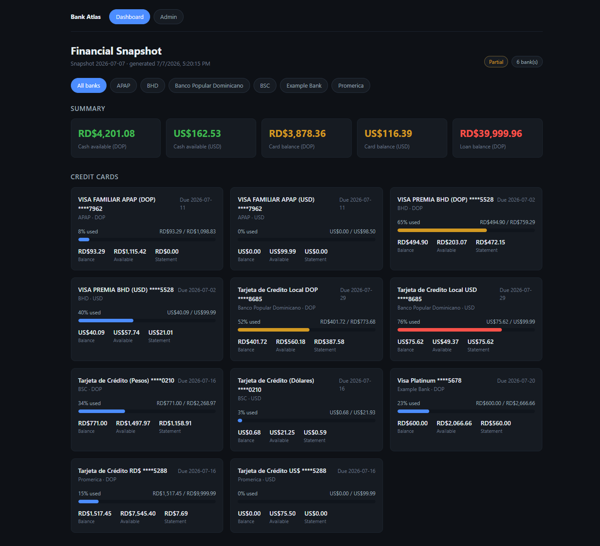
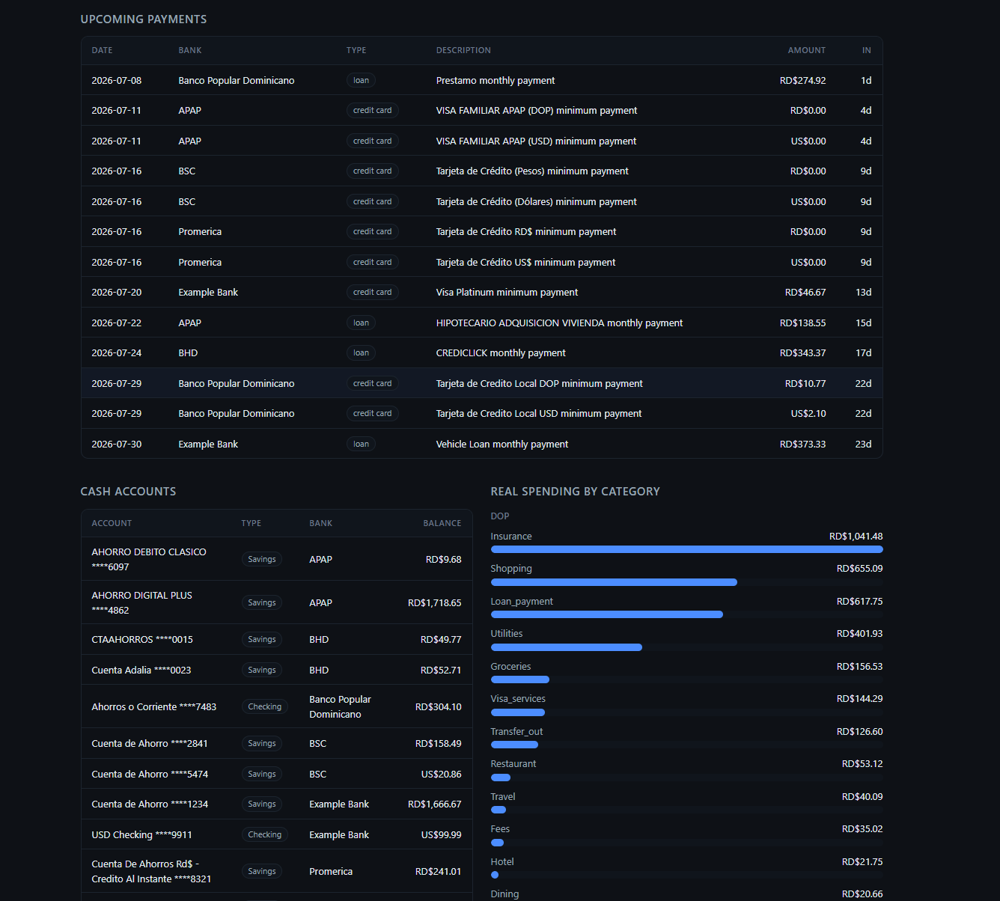
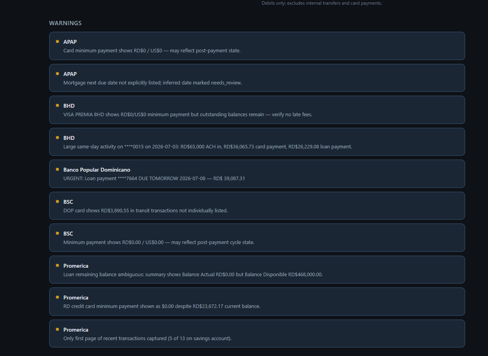
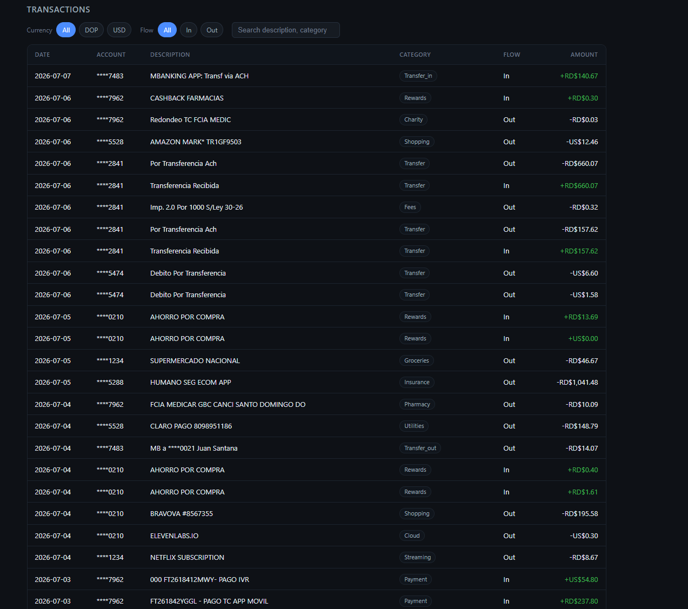
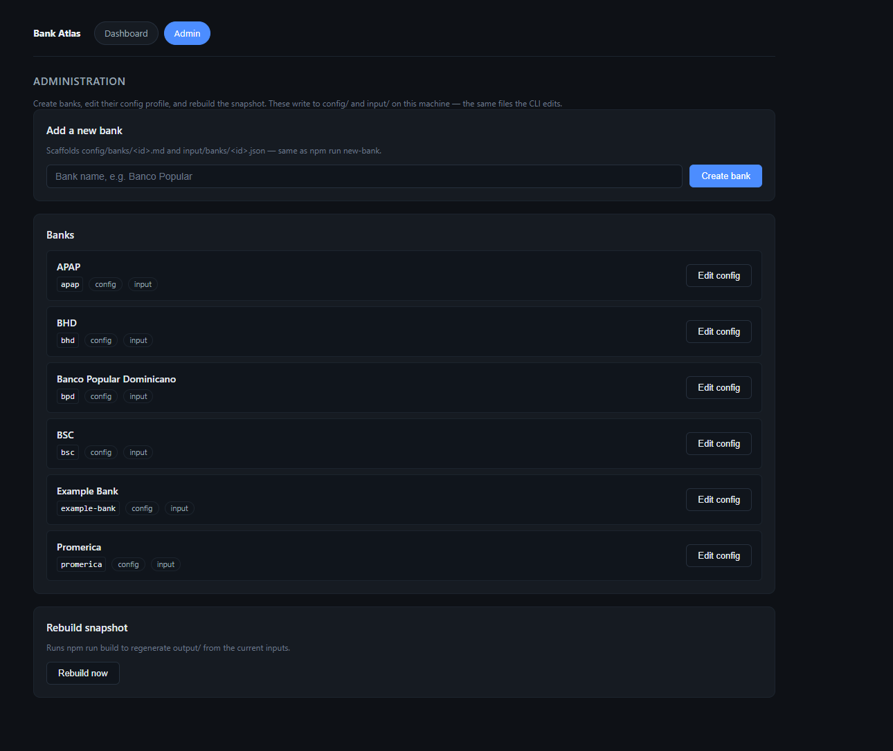
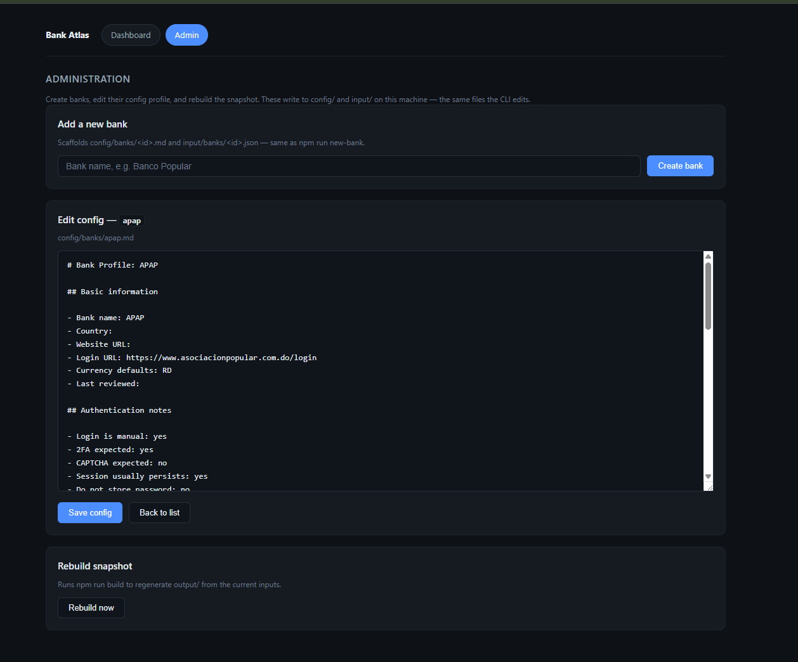

# bank-atlas — MCP Personal Finance Workspace

[](https://nodejs.org/)
[](LICENSE)
[](package.json)
[](docs/03-mcp-environment-setup.md)
[](#quick-start)
[](https://github.com/ggarciasoft/bank-atlas)

A local, **no-app** personal finance workflow for an AI coding agent (Cursor Agent or
VS Code GitHub Copilot Agent Mode) plus **Playwright MCP**. It is not a SaaS or hosted
backend — it is a repeatable workspace where an agent reads your own bank pages and
produces a local financial snapshot, with an optional **local web dashboard** to browse it.

The workspace has four parts:

- **Docs** (`docs/01`–`15`, `docs/README.md`) — the goal, safety boundaries, schema, and playbooks.
- **Agents** (`prompts/` + `.cursor/rules/`) — focused roles the agent plays.
- **Code** (`tools/`) — zero-dependency Node tooling that normalizes data and builds the
  output files, so nothing is hand-written.
- **Web** (`web/`) — a local, read-only dashboard served by `npm run serve`.

## What the agent does

1. Opens a bank website in a **visible** browser through Playwright MCP.
2. Pauses while **you** manually complete login, 2FA, CAPTCHA, or any verification.
3. Reads only visible financial information after you are authenticated.
4. Records it as structured input, then builds a snapshot as Markdown, JSON, and CSV.
5. Never bypasses security controls or performs account-changing actions.

## Core safety principle

The agent is an assistant operating tools under your supervision. It must **never** bypass
banking security, evade bot detection, solve CAPTCHA, intercept OTP codes, store passwords
or full account numbers, or perform transfers/payments/settings changes. Full rules live in
`docs/02-safety-boundaries.md` and the always-on rule `.cursor/rules/00-safety-boundaries.mdc`.

## How it works (data flow)

```text
Bank website (visible browser)          statements/*.csv, *.pdf
        │  extraction agent                     │  ingest agent
        ▼                                        ▼
        input/banks/<bank_id>.json   ◄───────────┘   (source of truth)
                    │  npm run build
                    ▼
        output/  financial-snapshot.{md,json} + accounts/credit_cards/loans/transactions.csv
                 output/history/<date>-*  •  output/finance.db (SQLite, optional)
                    │  npm run serve
                    ▼
                 web/  local dashboard at http://127.0.0.1:4173/ (reads output/ live)
```

`input/` is the source of truth; everything in `output/` is generated — treat it as build
artifacts. Rerun `npm run build` anytime to regenerate.

## Quick start

Requires Node.js >= 18. No dependencies to install (`npm install` is optional; there are none).

```bash
npm run new-bank -- "My Bank"        # scaffold config/banks/<id>.md + input/banks/<id>.json
# then fill input/banks/<id>.json — via the extraction agent (browser) or:
npm run ingest -- --bank my-bank --file statements/jul.csv   # import a statement CSV

npm run build                        # normalize inputs -> output/ (md, json, 4 csv) + history
npm run validate                     # schema + masking checks
npm run audit                        # scan for secrets / unmasked account numbers
npm run review                       # read-only summary of the current snapshot
npm run serve                        # open the local web dashboard (http://127.0.0.1:4173/)

npm run db                           # (optional) record the snapshot into output/finance.db
npm run trends                       # (optional) cash/debt trends by currency over time

npm test                             # unit tests for the tooling
```

A worked example ships in `input/banks/example-bank.json` — `npm run build` turns it into a
complete `output/` snapshot out of the box.

## Commands

| Command | Browser? | Description |
|---|---|---|
| `npm run new-bank -- "Name"` | no | Scaffold a bank profile (`config/banks/`) + input file (`input/banks/`) |
| `npm run ingest -- --bank <id> --file <csv>` | no | Import a statement CSV into `input/banks/<id>.json` |
| `npm run build [-- --date YYYY-MM-DD]` | no | Normalize inputs → `output/` files + timestamped history + summary |
| `npm run validate` | no | Check inputs and snapshot against the schema and masking rules |
| `npm run audit` | no | Scan the workspace for secrets and unmasked (>=12-digit) numbers |
| `npm run review` | no | Print a read-only summary of the current snapshot |
| `npm run serve [-- --port 4173]` | no | Serve the local web dashboard (`web/` + live `/api/snapshot`) |
| `npm run db` | no | Save the current snapshot into `output/finance.db` (idempotent per date) |
| `npm run trends` | no | Show cash / card-debt / loan-debt by currency across snapshots |
| `npm test` | no | Run the unit tests |

All commands are also available directly: `node tools/cli.js <command>` (or `atlas <command>`).

## Agents

Reusable prompts live in `prompts/`; always-on behavior lives in `.cursor/rules/`.

| Agent | Prompt | Browser? | Purpose |
|---|---|---|---|
| Extraction | `prompts/extraction-agent.md` | yes | Read visible bank data → `input/banks/` |
| Statement ingest | `prompts/statement-ingest-agent.md` | no | Import CSV/PDF statements → `input/banks/` |
| Normalizer | `prompts/normalizer-agent.md` | no | Build `output/` from inputs via the tools |
| Review | `prompts/review-agent.md` | no | Summarize the snapshot, flag what to check |
| History & trends | `prompts/history-trends-agent.md` | no | Record snapshots in SQLite, analyze trends |
| Safety audit | `prompts/safety-audit-agent.md` | no | Scan for secrets / unmasked numbers / unsafe patterns |
| New bank | `prompts/new-bank-agent.md` | no | Onboard a bank using non-sensitive info only |

Typical run: **Extraction** and/or **Statement ingest** → **Normalizer** → **Review** →
**History & trends**, with **Safety audit** before you trust or commit anything.
After `npm run build`, run `npm run serve` to browse the snapshot in the browser.
See `prompts/README.md` for details.

## Web dashboard

A small, **local-only** web UI lives in `web/`. It never connects to banks or stores
credentials. The **Dashboard** view is read-only and reads the built snapshot from
`output/financial-snapshot.json` on each request via `/api/snapshot`. The **Admin** view
adds a few local file operations (create a bank, edit a bank config, rebuild the snapshot)
so you can do common chores from the browser instead of the console.

### What it shows

- **Summary** — cash available, credit card balances, and loan debt by currency
- **Bank tabs** — filter the view to one bank or all banks in the snapshot
- **Credit cards** — utilization bars with balance, available credit, and statement balance
- **Upcoming payments** — due dates and minimum payments from the built summary
- **Cash accounts** — checking/savings balances with masked account identifiers
- **Spending by category** — real debits only (excludes internal transfers and card payments)
- **Warnings** — extraction notes and items flagged during ingest (e.g. in-transit balances)
- **Transactions** — filter by currency, flow (in/out), and free-text search

Any bank you extract and build appears automatically — no frontend changes required.

### Screenshots

Sample UI from `npm run build` + `npm run serve` using demo data in `input/banks/` (amounts
scaled under RD$10,000 / US$100).

#### Dashboard

**Summary and credit cards** — bank filter tabs, cash/card/loan totals, and utilization bars.



**Upcoming payments, cash accounts, and spending by category** — due dates, masked account
balances, and debit-only category breakdown.



**Warnings** — extraction notes and items flagged for review across banks.



**Transactions** — filter by currency, flow, and search; debits and credits with categories.



#### Admin

**Bank list** — create a bank, open its config, or rebuild the snapshot from the browser.



**Config editor** — edit `config/banks/<id>.md` (safe pages, login URL, extraction notes).



### Admin view

Open **http://127.0.0.1:4173/#/admin** (or click **Admin** in the top nav) to:

- **Add a new bank** — scaffolds `config/banks/<id>.md` + `input/banks/<id>.json`, exactly
  like `npm run new-bank`. The `<id>` is slugified from the name.
- **Edit a bank config** — open a bank's profile (`config/banks/<id>.md`) in an editor and
  save it back. This is the safe/forbidden-pages profile the extraction agent reads.
- **Rebuild snapshot** — runs `npm run build` to regenerate `output/` from the current inputs.

The Admin view still never touches a browser or a bank — it only edits local files under
`config/` and `input/` and rebuilds `output/`, the same things the CLI does. The server
binds to `127.0.0.1`, so these write routes are only reachable from this machine.

### HTTP API

| Method & path | Description |
|---|---|
| `GET /api/snapshot` | The built snapshot JSON (read-only) |
| `GET /api/banks` | List banks (union of config profiles and input files) |
| `POST /api/banks` | Create a bank — body `{ "name": "My Bank" }` |
| `GET /api/banks/<id>/config` | Read `config/banks/<id>.md` |
| `PUT /api/banks/<id>/config` | Write `config/banks/<id>.md` — body `{ "content": "..." }` |
| `POST /api/build` | Rebuild `output/` from current inputs |

### How to run

Build (or rebuild) the snapshot first, then start the server:

```bash
npm run build
npm run serve
```

Open **http://127.0.0.1:4173/** in your browser. Use a custom port if needed:

```bash
npm run serve -- --port 8080
```

Stop the server with `Ctrl+C`. The dashboard always reflects the current
`output/financial-snapshot.json`; rerun `npm run build` and refresh the page after new
extractions or statement imports.

### Files

| Path | Role |
|---|---|
| `web/index.html` | Page shell |
| `web/styles.css` | Dashboard + admin styles (no external CSS) |
| `web/app.js` | Renders the Dashboard and Admin views; talks to the API |
| `tools/lib/serve.js` | Zero-dependency static + snapshot + admin API server |
| `tools/lib/admin.js` | List banks, read/write a bank config, scaffold a bank |

The server binds to `127.0.0.1` by default and is intended for local use only.

## Statement ingestion & history

- **CSV/TSV import** auto-detects common English/Spanish columns (date/fecha,
  description/concepto, debit/debito, credit/credito, amount/monto, currency/moneda),
  handles single-amount or split debit/credit layouts, masks identifiers, and skips
  duplicates. Override detection with `--date-col`, `--desc-col`, `--amount-col`,
  `--debit-col`, `--credit-col`, `--currency-col`. Sample: `examples/sample-statement.csv`.
- **PDF/image statements** are read by the ingestion agent (there is no binary parser).
- **History** uses Node's built-in `node:sqlite` (no external dependency). `output/finance.db`
  and `output/history/` hold real data and are git-ignored.

## Project structure

```text
├─ docs/                   Reference documentation (`01`–`15`, index in `docs/README.md`)
├─ .cursor/                mcp.json + rules/ (agent behavior)
├─ .vscode/                mcp.json (Copilot Agent Mode)
├─ config/banks/           One profile per bank (safe/forbidden pages, risks)
├─ input/banks/            Per-bank extracted data (source of truth; real files git-ignored)
├─ statements/             Drop CSV/PDF statements here for offline ingestion
├─ examples/               Sample statement CSV
├─ img/                    Dashboard and admin screenshots (README samples)
├─ output/                 Generated snapshot: md, json, 4 csv, history/, finance.db
├─ prompts/                Agent prompt files
├─ tools/                  Zero-dependency Node CLI + libs + tests
└─ web/                    Local read-only dashboard (served by npm run serve)
```

## Tool stack

- Cursor Agent or VS Code GitHub Copilot Agent Mode
- Playwright MCP server (visible browser) — configured in `.cursor/mcp.json` / `.vscode/mcp.json`
- Node.js >= 18 (built-in `node:sqlite` for optional history)
- Local files: Markdown, JSON, CSV, optional SQLite, and an optional local web dashboard

## Reference documentation

Read these in order for the full workflow (or start at `docs/README.md`):

1. `docs/01-goal-and-scope.md`
2. `docs/02-safety-boundaries.md`
3. `docs/03-mcp-environment-setup.md`
4. `docs/04-ai-agent-operating-instructions.md`
5. `docs/05-browser-session-workflow.md`
6. `docs/06-bank-profile-template.md`
7. `docs/07-extraction-playbook.md`
8. `docs/08-data-schema.md`
9. `docs/09-output-formats.md`
10. `docs/10-runbooks.md`
11. `docs/11-prompt-library.md`
12. `docs/12-quality-checklist.md`
13. `docs/13-troubleshooting.md`
14. `docs/14-future-upgrades.md`
15. `docs/15-official-references.md`
